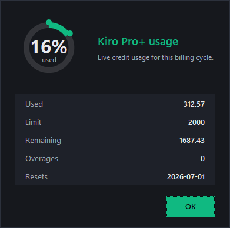
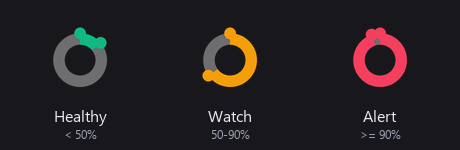

# Kiro Usage Widget

[](https://github.com/yeeyon/kiro-usage-widget/actions/workflows/ci.yml)


A tiny tray / menu-bar widget that shows your **Kiro Pro+ credit usage** as a
live gauge and alerts you when you cross the **50%** and **90%** marks — so you
never get surprised by overage charges.

> **Windows** is the primary, fully-tested platform. **macOS** and **Linux** are
> supported in **beta** — the data layer and rendering are verified on real
> macOS/Linux runners in CI, but the live menu-bar look and autostart-on-reboot
> still want a human eyeball. [Reports welcome.](https://github.com/yeeyon/kiro-usage-widget/issues)

<p align="center">
  
</p>

The gauge shifts color as credits burn — green while healthy, amber as you
approach your limit, red when you're nearly out:

<p align="center">
  
</p>

- 🎯 Live gauge in the tray / menu bar — green → amber → red as credits burn
- 🔔 One alert per threshold per billing cycle (no nagging)
- 🪟 Windows: borderless dark popup · 🍎 macOS: native dialog + notification
- 🔄 Auto-syncs from Kiro's own local data — no login, no API keys, no network calls
- 🚀 Runs in the background and starts on login

> Reads the same numbers shown in Kiro's status bar, straight from Kiro's local
> SQLite cache on your machine. Nothing is sent anywhere.

---

## Install (clone & run)

```bash
git clone https://github.com/yeeyon/kiro-usage-widget.git
cd kiro-usage-widget
```

**Windows** — double-click **`setup.bat`** (or run it from a terminal).

**macOS / Linux** —
```bash
bash setup.sh
```

The setup will: find Python, install dependencies, verify it can read your Kiro
usage, register autostart (Startup shortcut on Windows · LaunchAgent on macOS ·
XDG autostart on Linux), and launch the widget.

### Requirements
- Windows 10/11, macOS 12+, or a Linux desktop with a system tray
- [Kiro](https://kiro.dev) installed and signed in (Pro / Pro+ / etc.)
- Python 3.9+
  - Windows: [python.org](https://www.python.org/downloads/) (tick *Add to PATH*) or `winget install Python.Python.3.12`
  - macOS: `brew install python` (includes Tk)
  - Linux: `sudo apt install python3 python3-pip python3-tk`

---

## Usage

- **Hover** the icon → exact credits + reset date
- **Right-click / menu** → *Usage details*, *Check now*, *Quit*
- Alerts fire automatically at 50% and 90%

### Make the icon always visible (Windows)
Windows hides new tray icons by default. Setup tries to pin it automatically;
if it's still hidden: **right-click taskbar → Taskbar settings → Other system
tray icons →** turn on the Kiro widget. (Or sign out / back in once.)

---

## Configure

Edit the top of `kiro_usage_widget.py`:

```python
THRESHOLDS   = [50, 90]   # percent marks that trigger an alert
POLL_SECONDS = 30         # how often it re-reads usage
```

Restart the widget after changes.

---

## Uninstall

- **Windows:** double-click **`uninstall.bat`**
- **macOS / Linux:** `bash uninstall.sh`

Then delete the folder.

---

## How it works

Kiro stores your usage locally in an SQLite DB (key `kiro.kiroAgent` →
`kiro.resourceNotifications.usageState`):

| OS | Path |
|----|------|
| Windows | `%APPDATA%\Kiro\User\globalStorage\state.vscdb` |
| macOS | `~/Library/Application Support/Kiro/User/globalStorage/state.vscdb` |
| Linux | `~/.config/Kiro/User/globalStorage/state.vscdb` |

The widget opens that file **read-only** every `POLL_SECONDS`, parses
`currentUsage` / `usageLimit`, and renders the gauge. It never writes to Kiro's
data and never makes network requests. Override the path for testing with the
`KIRO_DB_PATH` environment variable.

> Numbers are as fresh as Kiro last wrote them. If Kiro is closed for a while,
> the figure can lag until Kiro next refreshes it.

---

## Development

```bash
python tests/make_fixture.py   # build a fixture DB (no Kiro needed)
python -m pytest -q            # run the test suite
```

CI runs the suite on **Windows, macOS, and Linux**, plus a `--selftest` against
the fixture and screenshot artifacts you can download from each run.

---

## License

MIT — see [LICENSE](LICENSE). Not affiliated with Kiro or AWS.
